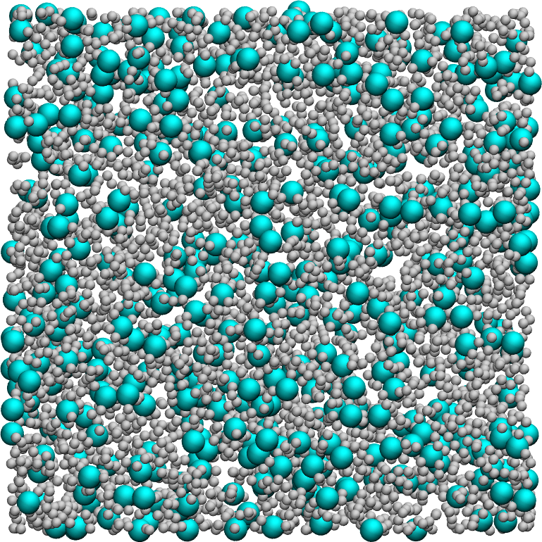

# 3D Lennard-Jones fluids

### Description

LAMMPS simple input for a binary gas of LJ particles in a 3D box.

### How to

Execute the input.lammps file using LAMMPS and visualize the dump file using VMD.

### Find LAMMPS tutorial

If you are new to LAMMPS, you can find [tutorials and instructions here](https://lammpstutorials.github.io/).

### Contact

Feel free to contact me by email if you have inquiries. You can find contact details on my [personal page](https://simongravelle.github.io/).
