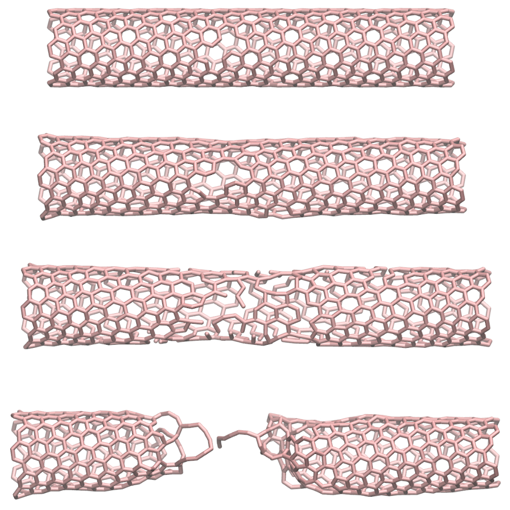

# Carbon nanotube under longitudinal strain

### Description

The simulation consists of a single carbon nanotube (CNT) in vacuum. At the beginning of the simulation, a few atoms are removed from the CNT. The CNT is divided into three parts: the central part and the two edges. The two edges are forced to move, which leads to the gradual elongation of the CNT. Eventually, the CNT breaks. The breaking of the chemical bonds is permitted by the use of a reactive force field (AIREBO). 

### How to

Simply run the input.lammps file using LAMMPS, and visualise the 'dump' output using VMD. The initial configuration has been generated using [TopoTools](https://sites.google.com/site/akohlmey/software/topotools) and [VMD](https://www.ks.uiuc.edu/Research/vmd/). If you are new to LAMMPS and VMD, you can find [tutorials and instructions here](https://lammpstutorials.github.io/).

### Output

This [video](https://www.youtube.com/watch?v=f1ve1j3yA6w) has been made with this script.

### Contact

Feel free to contact me by email if you have inquiries. You can find contact details on my [personal page](https://simongravelle.github.io/).
