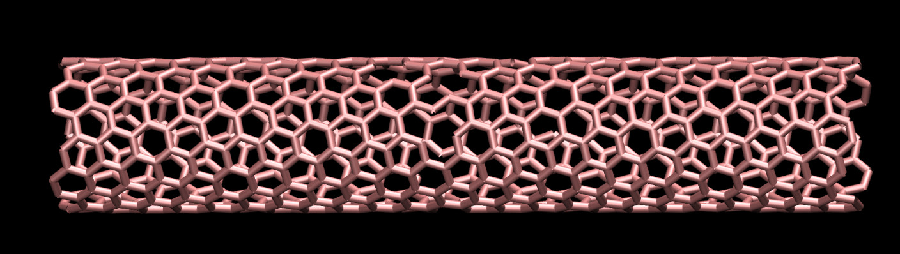

## Carbon nanotube under longitudinal strain using a reactive force field

### Description

The simulation consists of a single CNT in vacuum. At the beginning of the simulation, a few atoms are removed from the CNT. The CNT is divided into three parts: the central part and the two edges. The two edges are forced to move, which leads to the gradual elongation of the CNT. Eventually, the CNT will break. The breaking of the chemical bonds is permit by the use of a reactive force field (AIREBO). 

### How to

Simply run the input.lammps file using LAMMPS, and visualise the 'dump' output using VMD or Ovito. The initial configuration has been generated using TopoTools (https://sites.google.com/site/akohlmey/software/topotools) and VMD (https://www.ks.uiuc.edu/Research/vmd/). A step-by-step tutorial describing the generation of a carbon structure using VMD and TopoTools is available here: https://lammpstutorials.github.io/

### Output

The following video has been made with this code : https://www.youtube.com/watch?v=f1ve1j3yA6w

### See also

My LAMMPS tutorial website : https://lammpstutorials.github.io/

