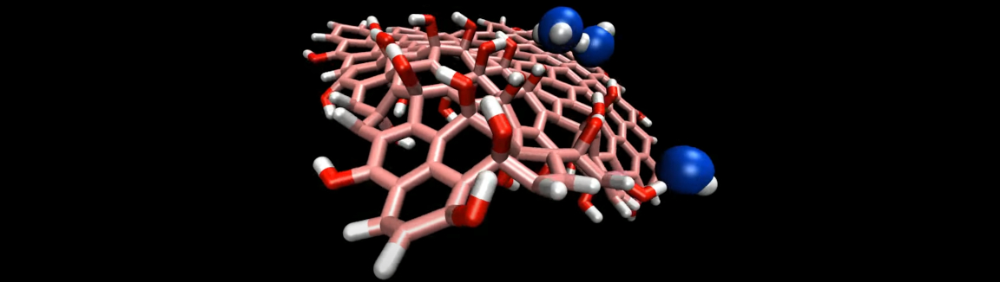

## Graphene oxide nanoparticle and water molecules

### Description

The simulation consists of a single graphene oxide particle in a box with a few water molecules.

### How to

Simply run the input.lammps file using LAMMPS, and visualise the 'dump' output using VMD or Ovito. The initial configuration has been generated with the help of 'make graphitics': https://github.com/velocirobbie/make-graphitics

### Output

The following video has been made with this code : https://www.youtube.com/watch?v=5DaTJFEyUmI

### See also

My LAMMPS tutorials website : https://lammpstutorials.github.io/

