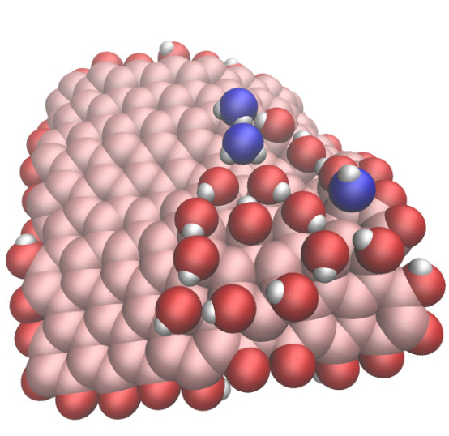

# LAMMPS input files

This folder contains input files for the [LAMMPS](https://www.lammps.org/) molecular simulation code.
If you are new to LAMMPS, you can find beginner and advanced user tutorials [here](https://lammpstutorials.github.io/).
For most folders, there is a corresponding video on my [youtube channel](https://www.youtube.com/channel/UCLmK_9wpyLVpcP7BPgN6BIw). 

    
  
  
  
  
  
    

## (Incomplete) list of input

* [2D Lennard-Jones fluids](2D-lennard-jones-fluid/)
* [3D Lennard-Jones fluids](3D-lennard-jones-fluid/)
* [Silicalite SiO2 MFI structure](bulk-silicalite/)
* [Melting a cube of gold metal](melting-gold/)
* [Reactivity of ion hydronium](illustration-ion-hydronium/)
* [Graphene oxide nanoparticle in interaction with water](GO-nanoparticle/)
* [NaCl ions in water](nacl-solution/)
* [NaCl crystal dissolution in water](salt-dissolution-water/)
* [Generation of amorphous carbon structure using the liquid quench method](amorphous-carbon/)
* [Adsorption combined with diffusion create pink noise in nanopore](reversibly-adsorbing-particles/)
* [Water-ethanol-Na-Cl mixture](water-ethanol/)
* [Simulating an oil-water-vapor interface](water-toluene-interface/)
* [Measure the surface tension of water](water-vapour/)

## Need more inputs?

Many more inputs are stored
in the [repository](https://github.com/lammpstutorials/lammpstutorials.github.io) of LAMMPS tutorials,
and in the [example folder](https://github.com/lammps/lammps/tree/develop/examples) of LAMMPS .

## Contact 

Feel free to contact me by [email](https://simongravelle.github.io/) if you have questions or requests.
