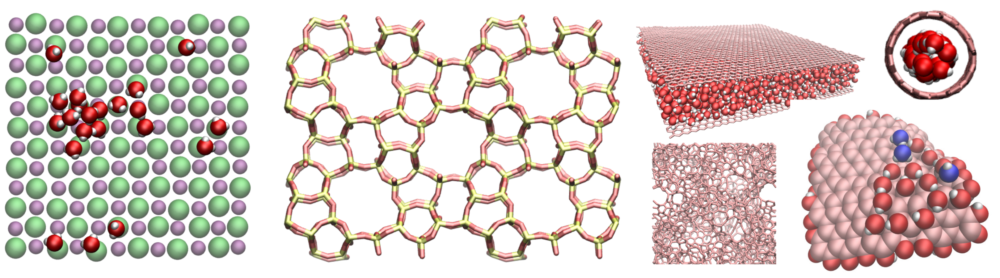

# LAMMPS input files

This folder contains input files for the LAMMPS molecular dynamics software. 

## Videos

For each folder, there is a video on my [youtube channel](https://www.youtube.com/channel/UCLmK_9wpyLVpcP7BPgN6BIw). 

## Tutorials 

If you are new to LAMMPS and VMD, you can find [tutorials and instructions here](https://lammpstutorials.github.io/).

## Contact 

Feel free to contact me by email if you have inquiries. You can find contact details on my [personal page](https://simongravelle.github.io/).
