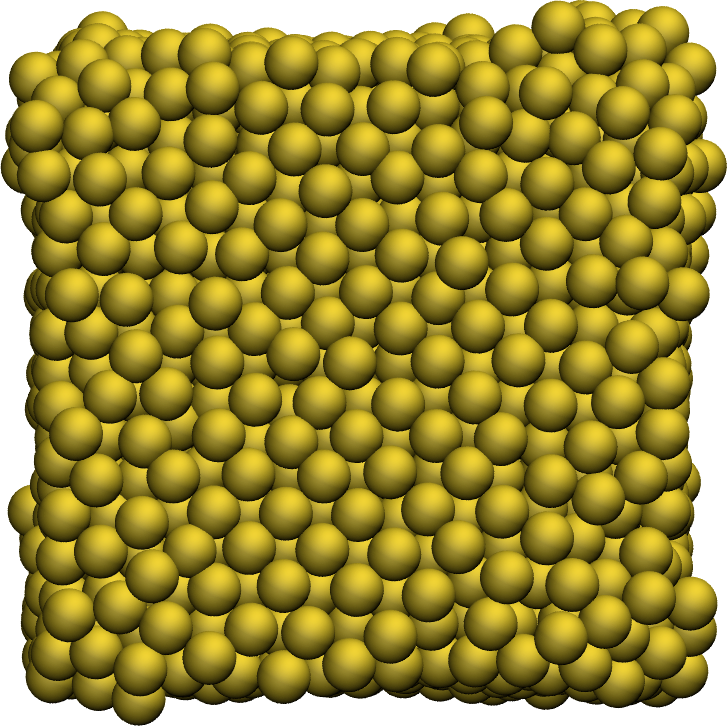
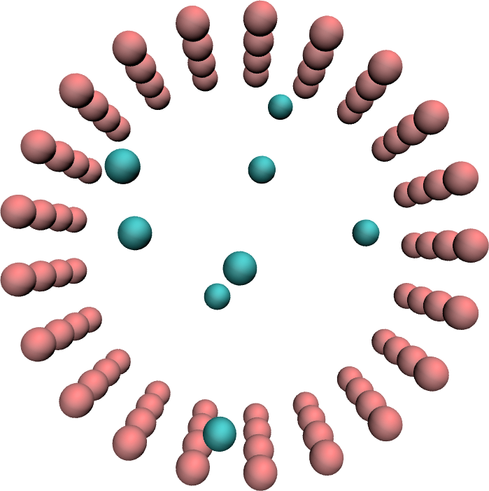

# LAMMPS input files

This folder contains input files for the [LAMMPS](https://www.lammps.org/)
molecular simulation code. If you are new to LAMMPS, you can find tutorials 
for beginners on [lammpstutorials.github.io](https://lammpstutorials.github.io/).
For most folders, there is a corresponding video
on [youtube](https://www.youtube.com/channel/UCLmK_9wpyLVpcP7BPgN6BIw). 

## How to cite

You can refer to the inputs in this directory using this
DOI: [10.5281/zenodo.13340908](https://zenodo.org/doi/10.5281/zenodo.13340907).

## Overview

    
    
    
    
    
    
    
    

## List of inputs

* [2D Lennard-Jones fluids](inputs/2D-lennard-jones-fluid/)
* [3D Lennard-Jones fluids](inputs/3D-lennard-jones-fluid/)
* [Generation of amorphous carbon structure using the liquid quench method](inputs/amorphous-carbon/)
* [Silicalite SiO2 MFI structure](inputs/bulk-silicalite/)
* [Melting a cube of gold metal](inputs/melting-gold/)
* [Reactivity of ion hydronium](inputs/illustration-ion-hydronium/)
* [Graphene oxide nanoparticle in interaction with water](inputs/GO-nanoparticle/)
* [NaCl ions in water](inputs/nacl-solution/)
* [NaCl crystal dissolution in water](inputs/salt-dissolution-water/)
* [Solid NaCl under compression](inputs/solid-NaCl-under-compression/)
* [Adsorption combined with diffusion create pink noise in nanopore](inputs/reversibly-adsorbing-particles/)
* [Water-ethanol-Na-Cl mixture](inputs/water-ethanol/)
* [Simulating an oil-water-vapor interface](inputs/water-toluene-interface/)
* [Measure the surface tension of water](inputs/water-vapour/)
* [Liquid mixture of PEG, water, and ethanol](inputs/liquid-mixture-PEG-water-ethanol/)
* [Water-co2 mixture in graphene slit](inputs/water-co2-in-graphene-slit/)
* [Water in graphene slit](inputs/water-in-graphene-slit/)

## Find more LAMMPS inputs

More input files are shared in:
- the [repository](https://github.com/lammpstutorials/lammpstutorials-inputs) of [lammpstutorials.github.io](https://lammpstutorials.github.io/),
- my [publication-data](https://github.com/simongravelle/publication-data) repository,
- the [example folder](https://github.com/lammps/lammps/tree/develop/examples) of LAMMPS.

## Contact 

Feel free to contact me by [email](https://simongravelle.github.io/) if you have questions or requests.

## Acknowledgments ##

This project has received funding from the European
Union's Horizon 2020 research and innovation programme
under the Marie Skłodowska-Curie grant agreement No 101065060.
