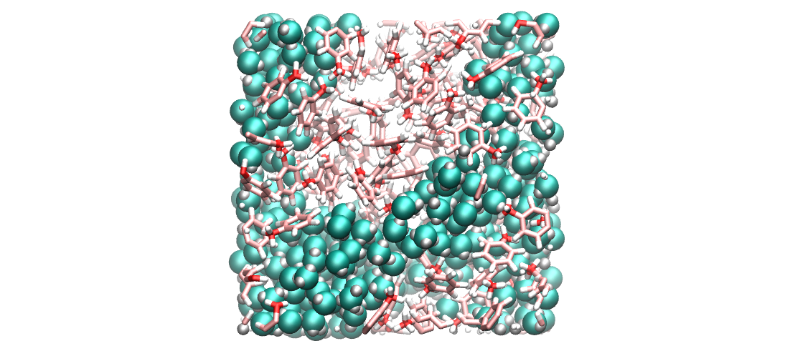

# LAMMPS input files

* [2D Lennard-Jones fluids](2D-lennard-jones-fluid/)
* [3D Lennard-Jones fluids](3D-lennard-jones-fluid/)
* [Water-ethanol-Na-Cl mixture](water-ethanol/)
* [Simulating an oil-water-vapor interface](water-toluene-interface/)
* [Measure the surface tension of water](water-vapour/)

This folder contains input files for the [LAMMPS](https://www.lammps.org/) molecular dynamics software. If you are new to LAMMPS, you can find beginner and advanced user tutorials [here](https://lammpstutorials.github.io/). There are also some more detailled scripts and how-to instructions [here](https://github.com/simongravelle/how-to-lammps).

  
  
  
  

## New to LAMMPS?

Have a look at [lammpstutorials.github.io](https://lammpstutorials.github.io/).

## Need more files?

Some more inputs are stored in the [repository](https://github.com/lammpstutorials/lammpstutorials.github.io) of LAMMPS tutorials.

## Videos

For most folders, there is a corresponding video on my [youtube channel](https://www.youtube.com/channel/UCLmK_9wpyLVpcP7BPgN6BIw). 

## Contact 

Feel free to contact me by [email](https://simongravelle.github.io/) if you have questions.
