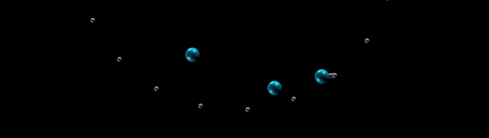

## Adsorption combined with diffusion create pink noise in nanopore

### Description

The simulation consists of particles diffusing inside a cylindrical nanopore. The surface of the nanopore is covered with adsorbing sites, and the particles reversibly adsorb at the inner surface of the nanopore. The adsorption/desorption processes are modelled using bond/create and bond/break commands respectively. A bond forms if a particle comes close enough to a trap. An additional harmonic potential is added to trapped particles. The wall of the cylinder is modelled using the wall/region command.

### How to

Run the input.lammps script using LAMMPS.

### Output

The following video has been made with this code : https://youtu.be/lIL5v0_ObnU

### See also

My LAMMPS tutorials website : https://lammpstutorials.github.io/

Our article on the origin of pink noise in nanopore : https://pubs.acs.org/doi/10.1021/acs.nanolett.9b02858

