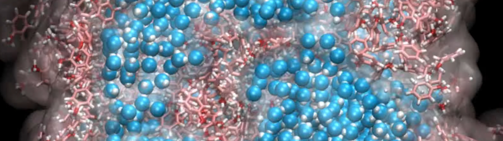

## Molecular dynamics simulation of a oil-water-vapor interface

### Description

Molecular dynamics simulation of a slab of initially mixed water and toluene molecules in contact with vacuum. The temperature is 300°K.

### How to

Run the GenerateData.m using octave or matlab, or just use the data.lammps already generated. Then, run the input.lammps using LAMMPS. Visualise the dump file using VMD of Ovito.

### Output

The following video has been made with this code : https://www.youtube.com/watch?v=rFG4MNJ5K10

### See also

My LAMMPS tutorials website : https://lammpstutorials.github.io/
