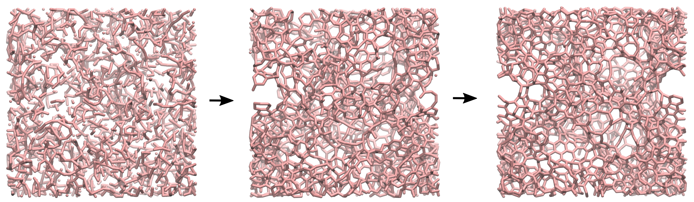

# Generation of amorphous carbon structure using the liquid quench method

### Description

LAMMPS input for carbon atoms, initially in the liquid state (high temperature). The temperature of the system is decreased progressively until hexagonal rings form. The final state is an amorphous nanoporous structure of carbon. This [video](https://youtu.be/P6M7mJdh7uM) has been made with this script.

### How to

Execute the input.lammps file using LAMMPS. Visualize the dump file using VMD.

### Find LAMMPS tutorial

If you are new to LAMMPS, you can find [tutorials and instructions here](https://lammpstutorials.github.io/).

### Contact

Feel free to contact me by email if you have inquiries. You can find contact details on my [personal page](https://simongravelle.github.io/).
