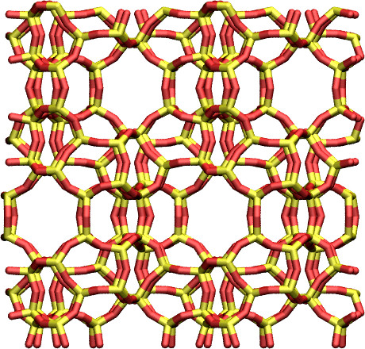

# Silicalite SiO2 MFI structure 

### Description

The system consists of a SiO2 MFI sctructure. The force field is the bond order potential SiO.tersoff.
This [video](https://www.youtube.com/watch?v=hyj0vCOnzJA) has been made with this script.

### How to

Run the input.lammps script using LAMMPS. If you are new to LAMMPS and VMD, you can find [tutorials and instructions here](https://lammpstutorials.github.io/).

### Find LAMMPS tutorial

If you are new to LAMMPS, you can find [tutorials and instructions here](https://lammpstutorials.github.io/).

### Contact

Feel free to contact me by email if you have inquiries. You can find contact details on my [personal page](https://simongravelle.github.io/).
