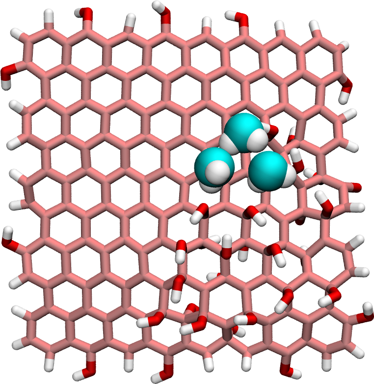

# Graphene oxide nanoparticle in interaction with water

### Description

The simulation consists of a single graphene oxide particle with a few water molecules.
The initial GO nanoparticle has been generated using [make graphitics](https://github.com/velocirobbie/make-graphitics).
This [video](https://www.youtube.com/watch?v=5DaTJFEyUmI) has been made with this script.

### How to

Run the input.lammps file using LAMMPS, and visualise the 'dump' output using VMD. If you are new to LAMMPS and VMD, you can find [tutorials and instructions here](https://lammpstutorials.github.io/).

### Find LAMMPS tutorial

If you are new to LAMMPS, you can find [tutorials and instructions here](https://lammpstutorials.github.io/).

### Contact

Feel free to contact me by email if you have inquiries. You can find contact details on my [personal page](https://simongravelle.github.io/).
