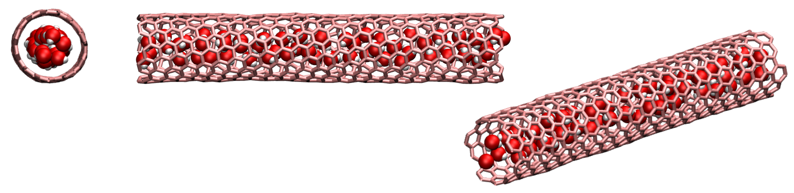

## Water inside carbon nanotube with grand canonical Monte Carlo

### Description

The first part of the run consists of a GCMC step. During this step, water molecules are added to a rigid CNT. The second part is a molecular dynamics step, during which the CNT is allowed to deform. 

### How to

Run the make-data-file.m using Octave or Matlab to create the lammps data file. Then, execute the input.lammps using LAMMPS. Visualise the dump file using VMD, and extract the evolution of the number of water molecule from the numberO.dat file. If you are new to LAMMPS and VMD, you can find [tutorials and instructions here](https://lammpstutorials.github.io/).

### Output

This [video](https://www.youtube.com/watch?v=fIAmqMLPaZw) has been made with this script.

### Contact

Feel free to contact me by email if you have inquiries. You can find contact details on my [personal page](https://simongravelle.github.io/).
