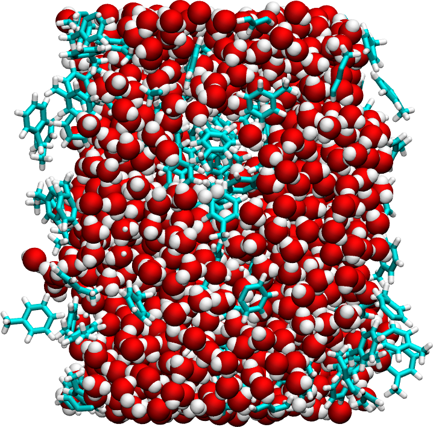

## Simulating an oil-water-vapor interface

</a>

### Description

Molecular dynamics simulation of a slab of initially mixed water and toluene molecules in contact with vacuum. The temperature is maintained at 300K. This [video](https://www.youtube.com/watch?v=rFG4MNJ5K10) has been made with this script.

### How to

Execute the input.lammps file using LAMMPS. Visualize the dump file using VMD. 

### Find LAMMPS tutorial

If you are new to LAMMPS, you can find [tutorials and instructions here](https://lammpstutorials.github.io/).

### Contact

Feel free to contact me by email if you have inquiries. You can find contact details on my [personal page](https://simongravelle.github.io/).
