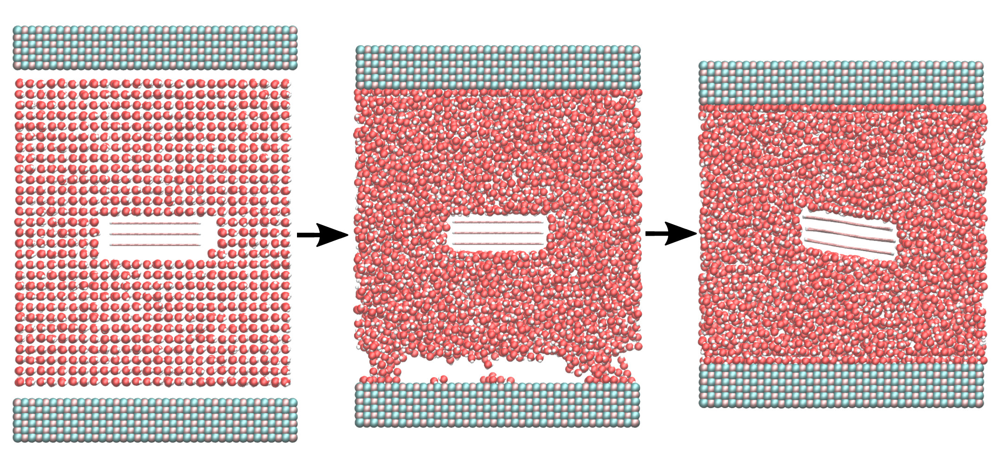

## Liquid exfoliation of a multilayer nanographene: out-of-equilibrium molecular dynamic simulation

### Description

The simulation consists of a nanoparticle made of multiple graphene layers in a box filled with water. A linear shear is imposed thanks to two moving walls.  With a shear rate of 1e10 1/s or higher, the layers separate from each other and the particle is exfoliated into multiple single layer particles.

### How to

From the 'Construction' folder, run the GenerateData.m script using Matlab (Octave should also work with a few modification). From the 'Equilibration' folder, run the input.lammps script using LAMMPS. Finally, run the input.lammps script within the 'Run' folder using LAMMPS.  If you are new to LAMMPS and VMD, you can find [tutorials and instructions here](https://lammpstutorials.github.io/).

### Output

This [video](https://www.youtube.com/watch?v=GALFLXkUEAU) has been made with this script.

### Contact

Feel free to contact me by email if you have inquiries. You can find contact details on my [personal page](https://simongravelle.github.io/).

### Citation

If you use this script, please consider citing [Gravelle, Kamal, Botto, Liquid exfoliation of multilayer graphene in sheared solvents: A molecular dynamics investigation, J. Chem. Phys. 152, 104701 (2020)](https://doi.org/10.1063/1.5141515)