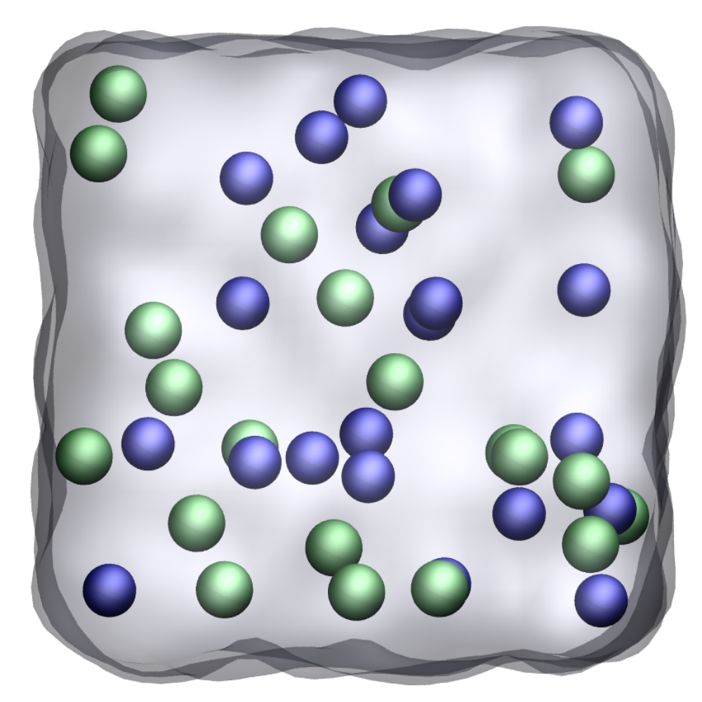

## NaCl ions in water

### Description

The simulation consists of a NaCl in water.

### How to

Run the GenerateConfLAMMPS.py script with python, then run input.npt.lammps and input.run.lammps using LAMMPS. If you are new to LAMMPS and VMD, you can find [tutorials and instructions here](https://lammpstutorials.github.io/).

### Contact

Feel free to contact me by email if you have inquiries. You can find contact details on my [personal page](https://simongravelle.github.io/).
