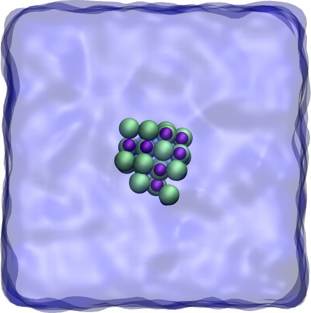

## NaCl crytal dissolution in water

### Description

The simulation consists of a cluster of NaCl in water. The temperature is 360K.

### How to

Run the input.lammps script using LAMMPS. If you are new to LAMMPS and VMD, you can find [tutorials and instructions here](https://lammpstutorials.github.io/).

### Output

This [video](https://www.youtube.com/watch?v=1ipJ8JQT0rc&t=3s) has been made with this script.

### Contact

Feel free to contact me by email if you have inquiries. You can find contact details on my [personal page](https://simongravelle.github.io/).
