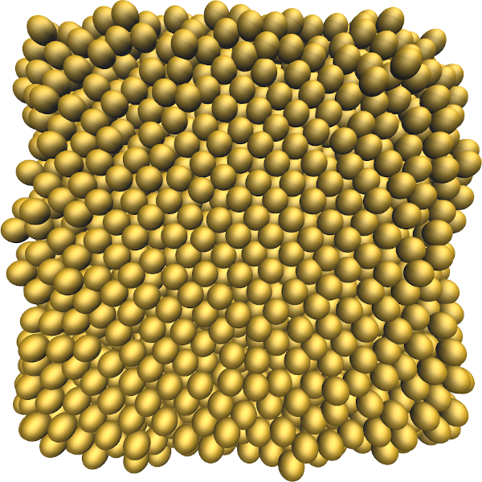

## Melting of a cube of gold metal using the embedded atom method (eam) force field

### Description

The simulation consists of a cube of gold atoms. The temperature is increased linearly during the simulation, and the initially solid cube eventuelly melts. 

### How to

Execute the input.lammps file using LAMMPS. Visualise the dump file using VMD.

### Output

This [video](https://youtu.be/aVxBxGGsqMAc) has been made with this script.

### Contact

Feel free to contact me by email if you have inquiries. You can find contact details on my [personal page](https://simongravelle.github.io/).
