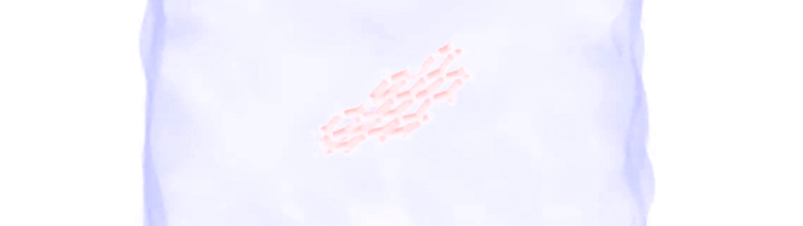

## The abnormal behaviour of graphene quantum dot in shear flow
 
### Description

The simulation consists of a molecule of hexabenzocoronene (sometimes referred to as the "molecular equivalent of graphene", or "graphene quantum dot") immersed in  water. A linear shear flow is imposed by two translating walls. The molecule structure has been downloaded from the [ATB repository](https://atb.uq.edu.au/). 

### How to

Run the GenerateData.m script using Octave. Then run the input.equilibrium.lammps script using LAMMPS. Finally run the input.lammps script using LAMMPS. If you are new to LAMMPS and VMD, you can find [tutorials and instructions here](https://lammpstutorials.github.io/).

### Output

This [video](https://www.youtube.com/watch?v=sSGt2CX8WxY) has been made with this script.

### Contact

Feel free to contact me by email if you have inquiries. You can find contact details on my [personal page](https://simongravelle.github.io/).

### Citation

If you use this script, please cite [Gravelle, Kamal, Botto, Violations of Jeffery's theory in the dynamics of nanographene in shear flow, Phys. Rev. Fluids 6 (2021) 034303](https://doi.org/10.1103/PhysRevFluids.6.034303)
