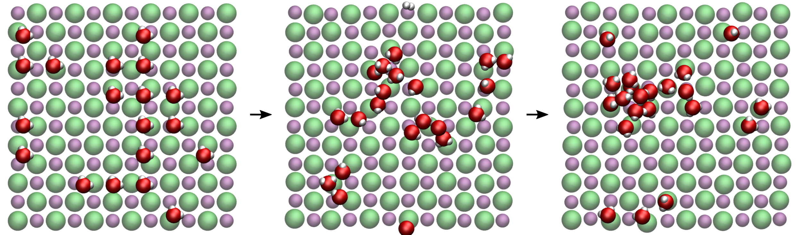

## Water at NaCl(100) surface

### Description

Molecular dynamics simulation of water molecules at a NaCl(100) crytal surface

### How to

Run the make-data-file.py using Python to create the lammps data file. Then, execute the input.lammps file using LAMMPS. Visualise the dump file using VMD. If you are new to LAMMPS and VMD, you can find [tutorials and instructions here](https://lammpstutorials.github.io/).

### Output

This [video](https://www.youtube.com/watch?v=v2_OGMO9NOA&t=4s) has been made with this script.

### Contact

Feel free to contact me by email if you have inquiries. You can find contact details on my [personal page](https://simongravelle.github.io/).

### Cite

If you use this script, please cite [this article](https://pubs.aip.org/aip/jcp/article/157/10/104702/2841856/Transport-of-thin-water-films-From-thermally).
